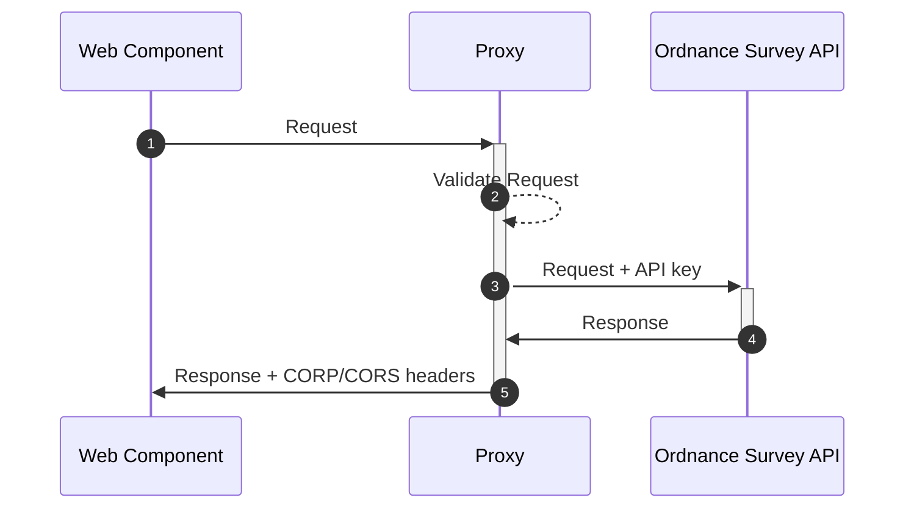

# How to: Use a MyMap & AddressAutocomplete with a proxy

## Context
Both `MyMap` and `AddressAutocomplete` can call the Ordnance Survey API directly, or via a proxy. 

Calling the API directly may be suitable for internal use, where exposure of API keys is not a concern, whilst calling a proxy may be more suitable for public use.

A proxy endpoint can be supplied via the `osProxyEndpoint` property on these components.

Proxies are required to complete the following actions in order to work successfully - 

- Append a valid OS API key as a search parameter to incoming requests
- Modify outgoing response with suitable CORS / CORP headers to allow the originating site access to the returned assets

## Diagram


## Examples
Please see the sample code below for how a proxy could be implemented - 

### Express
Below is an annotated example of a simple proxy using [Express](https://github.com/expressjs/express) & [http-proxy-middleware](https://github.com/chimurai/http-proxy-middleware).

**index.js**
```js
import express from "express";
import { useOrdnanceSurveyProxy } from "proxy";

const app = express()
const port = 3000

app.use('/proxy/ordnance-survey', useOrdnanceSurveyProxy)

app.listen(port)
```

**proxy.js**
```js
import { createProxyMiddleware } from "http-proxy-middleware";

const OS_DOMAIN = "https://api.os.uk";

export const useOrdnanceSurveyProxy = async (req, res, next) => {
  if (!isValid(req)) return next({
    status: 401,
    message: "Unauthorised"
  })

  return createProxyMiddleware({
    target: OS_DOMAIN,
    changeOrigin: true,
    onProxyRes: (proxyRes) => setCORPHeaders(proxyRes),
    pathRewrite: (fullPath, req) => appendAPIKey(fullPath, req)
    onError: (_err, _req, res) => {
      res.json({
        status: 500,
        message: "Something went wrong",
      });
    },
  })(req, res, next);
};

const isValid = (req) => {
  // Your validation logic here, for example checking req.header.referer against an allowlist of domains
}

// Ensure that returned tiles can be embedded cross-site
// May not be required if "same-site" policy works for your setup
const setCORPHeaders = (proxyRes: IncomingMessage): void => {
  proxyRes.headers["Cross-Origin-Resource-Policy"] = "cross-origin"
}

export const appendAPIKey = (fullPath, req) => {
  const [path, params] = fullPath.split("?");
  // Append API key
  const updatedParams = new URLSearchParams(params);
  updatedParams.set("key", process.env.ORDNANCE_SURVEY_API_KEY);
  // Remove our API baseUrl (/proxy/ordnance-survey)
  const updatedPath = path.replace(req.baseUrl, "");
  // Construct and return rewritten path
  const resultPath = [updatedPath, updatedParams.toString()].join("?");
  return resultPath;
};
```
> A working and more fleshed out example (in TypeScript) can be seen [here in the PlanX API](https://github.com/theopensystemslab/planx-new/blob/production/api.planx.uk/proxy/ordnanceSurvey.ts).